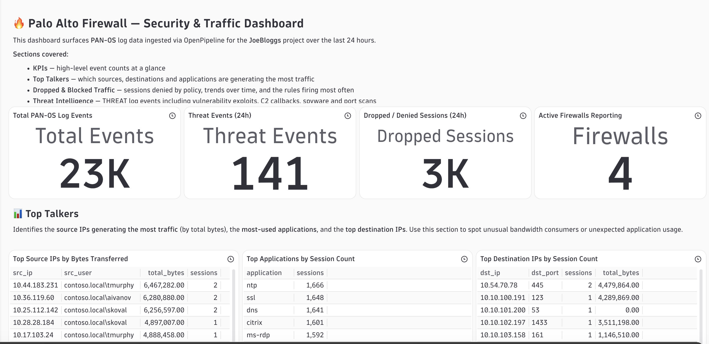

# Dynatrace Assist &mdash; AI-Created Dashboards, Notebooks & Alerts

### Use Dynatrace Assist's agentic AI to generate a Palo Alto focused dashboard, notebook, and alert &mdash; using nothing but a plain-English prompt.

## 1. Open Dynatrace Assist

1. From the left navigation, select **Dynatrace Assist** (the AI icon).

2. Make sure you are in **Agentic** mode &mdash; the toggle should show **Agent**, not **Chat**.


---

## 2. Create the Palo Alto Dashboard

Paste the following prompt into Dynatrace Assist - please change project to your **project name**:

```
Can you help me create a Palo Alto log focused dashboard? I have a number of logs coming in for my Palo at the moment and want to surface the top talkers / issues and dropped traffic, also any trends we can pull out?

Using the "Dynatrace document structure - Dashboards" in our documentation as a reference. Generate the json in a code block I can copy/paste and upload to the document myself.

Use a sensible layout, and include description markdown for new users who might not be familiar with the available data.

Ensure that all the DQL is executable and that it returns data for the last 24 hours

All of the tiles need to filter by project = JoeBloggs
```


Dynatrace Assist will:

1. Inspect your available log data and field schema.
2. Draft a set of DQL queries covering top source IPs, top destination IPs, top applications, action breakdown (allow / deny), dropped traffic volume over time, and byte throughput trends.
3. Creat a dashboard json you can import.
4. Provide instructions on how to import your new dashboard=.


---

## 3. Copy the JSON into a Dashboard

Dynatrace Assist generates the DQL queries and describes the layout in a Dashboard JSON that can be imported:

1. Open **Dashboards** from the left navigation and create a new dashboard.

2. Click the Dashboard name and then **Edit JSON**

3. Paste in the dashboard JSON and click Save


!!! info "Dashboard not populating or see and error?"
    Give Dynatrace Assist the error message or describe the issue you are seeing, it will fix it for you.

Example Dashboard:



---

## 4. Generate a Notebook for Deeper Investigation

Back in Dynatrace Assist, prompt (please ensure you set your own project name):

> **Can you create a notebook that lets me investigate the dropped traffic in more detail? I want to see which rules are triggering the most denies and which source/destination pairs are being blocked. Ensure you filter by project = JoeBloggs**

The agent will create a notebook with annotated DQL sections covering:

- Deny count by rule name
- Blocked source/destination pairs
- Timeline of block events


---

## 5. Create an Alert for Dropped Traffic Spikes

Ask Dynatrace Assist to wire up a metric alert, (please ensure you set your own project name):

> **Can you set up an alert that fires if the number of denied firewall connections spikes significantly compared to the last hour's baseline? Ensure you filter by project = JoeBloggs**

The agent will:

1. Create a DQL-backed metric or use an existing metric event.
2. Propose an anomaly detection condition.
3. Ask for confirmation before saving the alert configuration.


---

## What Dynatrace Assist Did Under the Hood

| Step | What happened |
|---|---|
| Field discovery | Assist queried your log schema to find available `pan.*` fields |
| Query generation | Wrote DQL for each tile based on your prompt |
| Layout generation | Arranged tiles into a logical dashboard structure |
| Notebook creation | Added explanatory markdown alongside each DQL block |
| Alert wiring | Mapped your intent to a metric anomaly detection rule |

!!! tip "Iterate naturally"
    You don't have to get the prompt perfect first time. Dynatrace Assist understands follow-up requests like *"add a tile for top destination ports"* or *"change the trend tile to show 24 hours"*.
