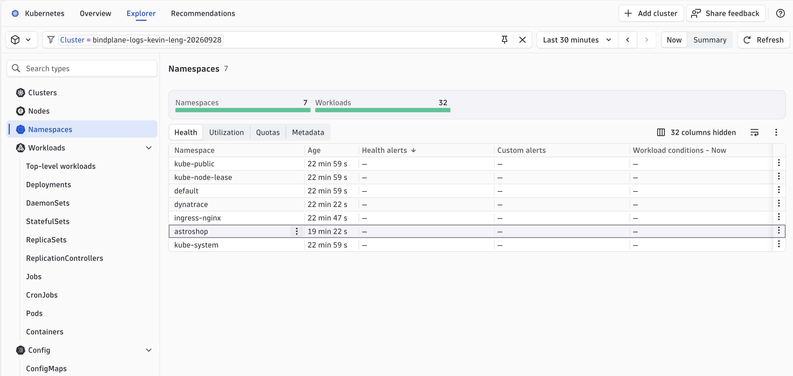
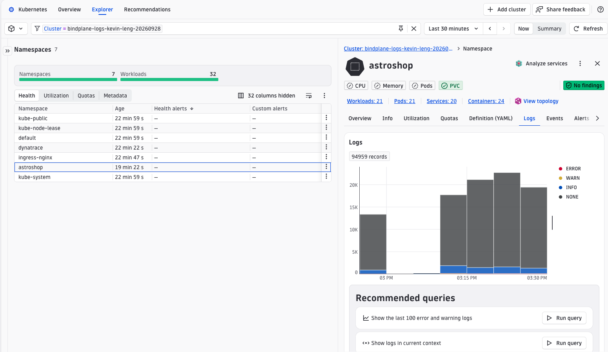
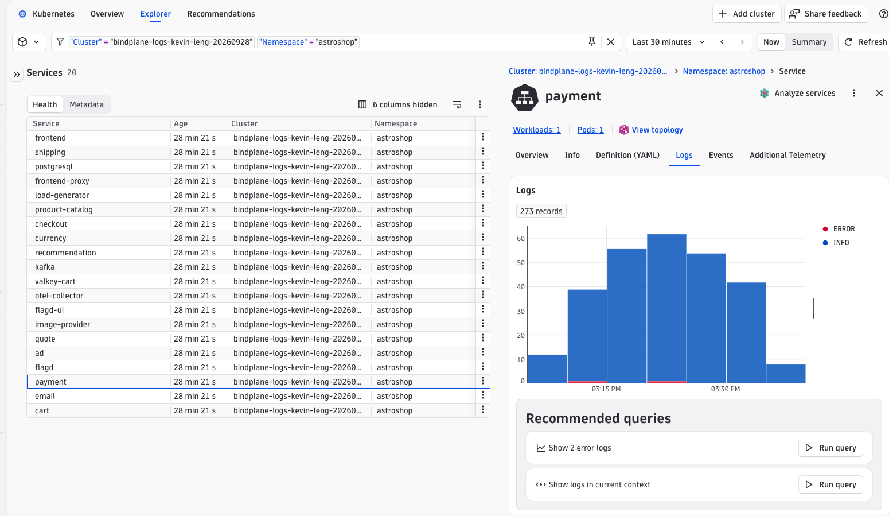
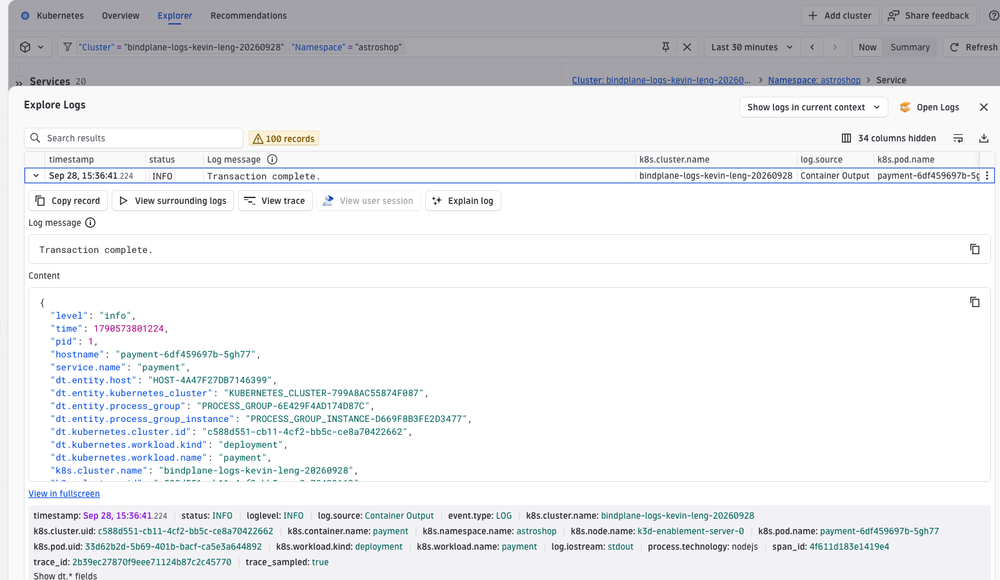
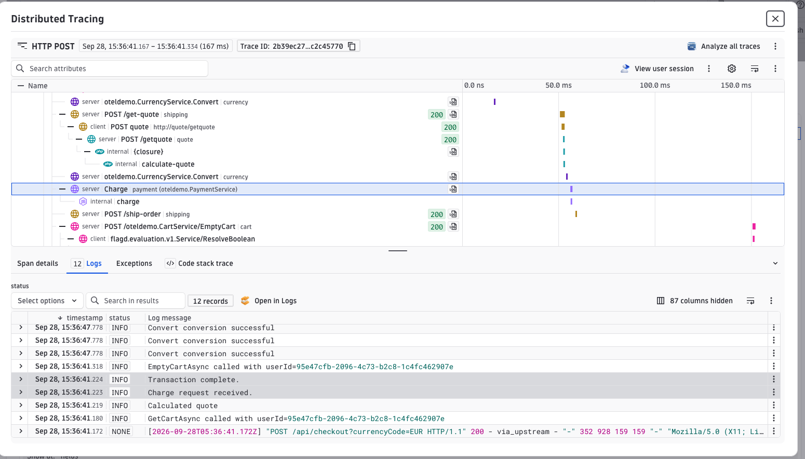

# Logs in Context

## The problem

A microservices application like astroshop handles a single user request by calling half a dozen services in sequence. Each service logs what it did, but the logs land in separate pods, separate namespaces, and separate streams. When something goes wrong, you face two compounding problems:

1. **Where are the logs?** You know something failed, but not which pod, workload, or namespace was involved. You filter by time and guess.
2. **Which logs belong together?** Even once you find one relevant log, the request touched five other services. Their logs are in completely separate streams with no shared identifier.

Without coordination, the only tool you have is timestamps — and on a busy cluster, a narrow time window still returns hundreds of candidates.

**Logs in context** solves both problems. Dynatrace automatically enriches every log record at ingest time with two layers of context:

- **Entity context** — every log is tagged with the Kubernetes cluster, namespace, pod, workload, and host it came from, as well as the Dynatrace service entity. This makes logs searchable and navigable by infrastructure entity without any manual tagging.
- **Trace context** — every log written during an instrumented request carries the `trace_id` and `span_id` of the active span. Dynatrace uses this to stitch logs together across services, pods, and namespaces for a single request — and to link directly from a log to the distributed trace, or from a trace to every log it produced.

## How it works with astroshop

[Astroshop](https://opentelemetry.io/docs/demo/) is the OpenTelemetry community's reference demo application: a microservices e-commerce platform where every service is instrumented with the OpenTelemetry SDK. The SDK's log bridge automatically injects `trace_id` and `span_id` into log records at emit time. No application code changes are required.

The services write structured JSON logs to stdout. The **Dynatrace Kubernetes Operator** manages two relevant components via the `DynaKube` custom resource:

- **OneAgent (DaemonSet)** — monitors processes running in every pod on the node, providing distributed tracing and APM.
- **Log Monitoring** — a separate feature enabled in the `DynaKube` spec that collects container logs from every pod on the node.

At collection time, OneAgent automatically attaches entity context — cluster, namespace, workload, pod, container, and host — to every log record. It also parses `trace_id` and `span_id` from the JSON body and stores them as first-class attributes. The result is that every log arrives in Dynatrace already tagged with both its infrastructure origin and its place in the distributed trace, with no manual pipeline configuration required.

!!! note "OTel is not a requirement"
    No application code changes are required here because astroshop already ships with the OTel SDK and log bridge configured. For your own services, you would need to initialize the OTel log bridge to get the same automatic injection.

    However, OTel is not the only path. If OneAgent is monitoring the process (not just collecting container logs), it can inject `trace_id` and `span_id` directly into log output at the agent level — even for services that use a plain logger with no OTel instrumentation. In that case, the correlation works the same way in Dynatrace; the difference is only in how the trace context gets into the log line.

## Lets Explore Logs in Content using in the Kubernetes app

Open the Dynatrace **Kubernetes** app and find your cluster.

### 1. Find your cluster

Open the **Explorer** tab at the top of the Kubernetes app. Use the filter bar to narrow the view to your cluster — your cluster name follows the format `bindplane-logs-{your-name}-{date}` (for example, `bindplane-logs-kevin-leng-20260928`). Select **Clusters** in the left panel and click your cluster to open it.

The overview shows node health, workload status, and any active problems across the cluster.

### 2. Navigate to the astroshop namespace

Click **Namespaces** in the left panel. The main area lists all namespaces in the cluster. Click the `astroshop` row to open it.

### 3. View logs for the entire namespace

With the `astroshop` namespace selected, click the **Logs** tab in the right-hand detail panel. Dynatrace shows every log record from every workload in the namespace — scoped automatically to the entity you selected, with no filter required.

In the **Recommended queries** panel at the bottom, click **Run query** next to **Show logs in current context** to open the Log Viewer pre-filtered to this namespace.

### 4. Narrow to a single service

Click **Services** just under `astroshop` in the left panel. The list shows every service Dynatrace has discovered in the `astroshop` namespace. Click a service — for example, `payment` — and then open its **Logs** tab.

The log count drops dramatically (from ~95k at namespace level to a few hundred for this service). The filter is applied automatically — Dynatrace already knows which pods and processes belong to the `payment` service.

!!! tip "Logs are already there"
    The Kubernetes Operator deployed OneAgent as a DaemonSet, which is already collecting container logs from every pod in the cluster. The correlation to cluster, namespace, workload, and pod happens automatically at collection time — you did not have to configure any of it.

## From a log to a trace

From any entity view — namespace, service, or workload — click **Run query** next to **Show logs in current context** to open the Log Viewer scoped to that entity. This is your starting point for exploring individual log records.

Every log record from an instrumented service carries `trace_id` and `span_id`, visible when you expand a record. Click the arrow on the left of any log row to open it. The detail view shows the full log content alongside every attribute Dynatrace enriched it with at ingest time — Kubernetes entity context (`k8s.cluster.name`, `k8s.namespace.name`, `k8s.node.name`, `k8s.pod.name`, `k8s.workload.name`) and, for instrumented services, `trace_id` and `span_id`.

Press `T` or click **View trace** in the action bar to open the correlated distributed trace directly — no copy-pasting of IDs required.

The trace opens in a side panel showing the full call graph. Click the **Logs** tab at the bottom to see every log record for that request — not just from the service you started in, but from every service that participated in the trace. In the example below, a single checkout request produced logs from the currency service, cart service, quote service, and payment service, all stitched together automatically using the shared `trace_id`.

Click an individual span — such as `Charge` in the payment service — to scope the log view to just that span.

## From a trace back to logs

You can also start from a trace and navigate to logs. Open the **Distributed Traces** app and find any astroshop trace. Click the **Logs** tab on the trace overview to see all logs for the full request across every service, or click into an individual span and open its **Logs** tab to scope the view to just that operation. Neither path requires knowing a pod name or writing a filter.

**Try it yourself:**

- Open the **Distributed Traces** app and find a checkout trace. Click the **Logs** tab on the trace overview — which services emitted logs, and in what order? Find the log that was emitted closest to the end of the trace.
- Open the **Services** app and find the `payment` service. Open its **Logs** tab — how does the log view here compare to what you saw when navigating to the service via the Kubernetes app?

**Checkpoint:** you can start from namespace-level logs, drill to a service, follow a trace, and scope logs to a specific span — all without writing a query or knowing which pod handled the request.

