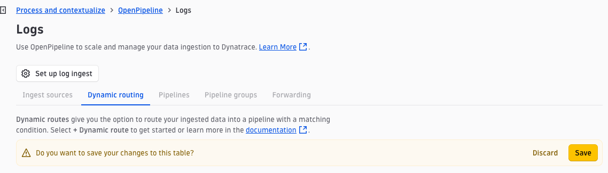

# OpenPipeline: Extracting Fields from Payment Logs

## The problem

The astroshop `paymentservice` logs every transaction it processes. The log arrives in Dynatrace as a structured record, but the commercially important details — order ID, currency, amount, payment provider, and outcome — are buried inside the message string. You can read them, but you cannot filter by them, aggregate them, or alert on them without parsing the string every time in a query.

OpenPipeline can do this parsing once, at ingest, and promote those values into top-level fields. After that, every query, dashboard, and alert in Dynatrace can use `payment.currency` or `payment.amount` directly — just like any other attribute.

## Look at a raw log first

Before writing an extraction rule, inspect what the `paymentservice` is actually logging.

In the Dynatrace **Kubernetes** app, open the **Explorer** tab and filter to your cluster. Click **Namespaces** in the left panel, select `astroshop`, then click **Services** just under `astroshop` and select `payment`. Open the **Logs** tab and expand a few records.

The `payment` service emits two log types. The one we care about is **"Transaction complete."** — it contains the commercially useful fields as a structured JSON object in the `content` field:

```json
{
  "msg": "Transaction complete.",
  "transactionId": "37ef9f4d-c2c3-407b-ad6d-49c455532f50",
  "cardType": "american-express",
  "lastFourDigits": "0005",
  "amount": {
    "units": { "low": 1053 },
    "nanos": 914197257,
    "currencyCode": "EUR"
  },
  "loyalty_level": "silver"
}
```

The fields you want to promote to top-level attributes are:

| JSON field | Target attribute |
|---|---|
| `msg` | `app.payment.msg` |
| `transactionId` | `app.payment.transactionId` |
| `cardType` | `app.payment.cardType` |
| `amount.units.low` | `app.payment.amount` |
| `amount.currencyCode` | `app.payment.currencyCode` |
| `loyalty_level` | `app.payment.loyaltyLevel` |

## Create the OpenPipeline pipeline

### 1. Open OpenPipeline

In Dynatrace, search for **OpenPipeline** or navigate to **Settings** → **Process and Contextualize** → **Logs**.

Click the **Pipelines** tab, then  select the pipeline you created earlier.

### 2. Add a Field Extraction processor

Expand the **Processing** drawer and click **+ Add**, then select **Add fields**.

Give it a descriptive name: `Extract payment fields`.

**Matching condition** — scope this processor to "Transaction complete." logs only:

```
matchesValue(k8s.namespace.name, "astroshop") and matchesValue(k8s.container.name, "payment") and matchesPhrase(content, "Transaction complete.")
```

The `content` field is a JSON string, so use a multi-step expression that parses it into a variant, extracts each field, then removes the intermediate variant to keep the record clean:

```
parse content, "JSON:json_content"
| fieldsAdd app.payment.msg           = json_content[`msg`]
| fieldsAdd app.payment.transactionId = json_content[`transactionId`]
| fieldsAdd app.payment.cardType      = json_content[`cardType`]
| fieldsAdd app.payment.amount        = json_content[`amount`][`units`][`low`]
| fieldsAdd app.payment.currencyCode  = json_content[`amount`][`currencyCode`]
| fieldsAdd app.payment.loyaltyLevel  = json_content[`loyalty_level`]
| fieldsRemove json_content
```

`app.payment.amount` captures `units.low` — the integer part of the protobuf amount (e.g. `1053` for a €1053 transaction). This is directly usable for aggregation without further conversion.

!!! tip "Test before saving"
    Paste a raw "Transaction complete." record into the sample input box and confirm all six fields appear in the output before saving.

**Sample log** — paste one of the raw payment records into the sample input box. Run the preview and confirm the five fields appear in the output before saving.

Click **Save**.

### 3. Add a Dynamic Route

The pipeline exists but nothing is flowing through it yet. Open the **Dynamic Routing** tab and modify the **Dynamic Route** you created earlier.


Ensure you change the cluster name to your cluster - your cluster name follows the format `bindplane-logs-{your-name}-{date}`

| Setting | Value |
|---|---|
| Name | `astroshop payment logs` |
| Matching condition | `matchesValue(k8s.cluster.name, "bindplane-logs-kevin-leng-20261006") or matchesValue(project, "JoeBloggs")` |
| Pipeline | `<Your-Pipeline-Name>` |

Save and confirm. **Remember to Save the changes to the Dynamic Routes!**



!!! warning "Dynamic routes apply to new records only"
    Records that arrived before the route was created are already stored and will not be reprocessed. Give it a minute for new payment logs to come through, then query.

## Verify the result

Open the Log Viewer and filter to the `payment` service. Open a recent "Transaction complete." record. The extracted fields should appear alongside the standard Kubernetes attributes:

- `app.payment.transactionId`
- `app.payment.cardType`
- `app.payment.amount`
- `app.payment.currencyCode`
- `app.payment.loyaltyLevel`

Once those fields exist as first-class attributes, they are queryable, filterable, and available in dashboards without any parsing in the query itself.

## DQL reference

**View raw "Transaction complete." logs:**
```dql
fetch logs
| filter k8s.cluster.name == "bindplane-logs-kevin-leng-20261006" and k8s.namespace.name == "astroshop" and k8s.container.name == "payment"
  and matchesPhrase(content, "Transaction complete.")
| fields timestamp, content
| limit 20
```

**Parse fields inline — use this to test the pattern before configuring OpenPipeline:**
```dql
fetch logs
| filter k8s.cluster.name == "bindplane-logs-kevin-leng-20261006" and k8s.namespace.name == "astroshop" and k8s.container.name == "payment"
  and matchesPhrase(content, "Transaction complete.")
| parse content, "JSON:json_content"
| fieldsAdd app.payment.transactionId = json_content[`transactionId`]
| fieldsAdd app.payment.cardType      = json_content[`cardType`]
| fieldsAdd app.payment.amount        = json_content[`amount`][`units`][`low`]
| fieldsAdd app.payment.currencyCode  = json_content[`amount`][`currencyCode`]
| fieldsAdd app.payment.loyaltyLevel  = json_content[`loyalty_level`]
| fieldsRemove json_content
| fields timestamp, app.payment.transactionId, app.payment.cardType, app.payment.amount, app.payment.currencyCode, app.payment.loyaltyLevel
| limit 20
```

**After extraction — view extracted fields**
```dql
fetch logs
| filter k8s.cluster.name == "bindplane-logs-kevin-leng-20261006" and k8s.namespace.name == "astroshop" and k8s.container.name == "payment"
  and matchesPhrase(content, "Transaction complete.")
| fields timestamp, app.payment.transactionId, app.payment.cardType, app.payment.amount, app.payment.currencyCode, app.payment.loyaltyLevel
| sort timestamp desc
```

**After extraction — count by card type and currency (no parse needed):**
```dql
fetch logs
| filter k8s.cluster.name == "bindplane-logs-kevin-leng-20261006" and k8s.namespace.name == "astroshop" and k8s.container.name == "payment"
  and matchesPhrase(content, "Transaction complete.")
| summarize transactions = count(), by: {app.payment.cardType, app.payment.currencyCode}
| sort transactions desc
```

**After extraction — transactions by loyalty tier:**
```dql
fetch logs
| filter k8s.cluster.name == "bindplane-logs-kevin-leng-20261006" and k8s.namespace.name == "astroshop" and k8s.container.name == "payment"
  and matchesPhrase(content, "Transaction complete.")
| summarize transactions = count(), by: {app.payment.loyaltyLevel}
| sort transactions desc
```

## What you can do with extracted fields

**Filter by card type in the Log Viewer:**
Select `app.payment.cardType = "american-express"` from the filter bar — no query required.

**Alert on a specific loyalty tier or card type:**
With `app.payment.loyaltyLevel` as a proper attribute, a Log Metric or custom alert can fire on specific conditions — no string matching against raw JSON required.


**Checkpoint:** `app.payment.transactionId`, `app.payment.cardType`, `app.payment.currencyCode`, and `app.payment.loyaltyLevel` appear as attributes on new `payment` service records, and you can filter and aggregate on them from the Log Viewer without writing a parse expression.
